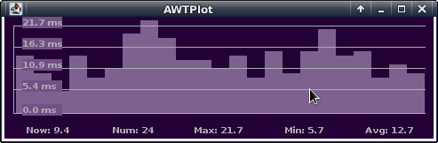

# AWTPlot

## Description

AWTPlot is a real-time graphical display of plotted numerical values received
from stdin.  The values can be generated by any process that results in a
single numerical value periodically piped into AWTPlot. See the examples below.
AWTPlot uses a configuration file written in XML. By adding, deleting, or
modifying various tags, the looks and behavior of AWTPlot can be changed.

AWTPlot provides a nice visual display of some metric of interest in such a way
that changes in that metric become immediately obvious. Network
connections/lag, memory use, CPU temperatures, and any other measurement you
can make with a tool that outputs to stdin can be piped into AWTPlot and
plotted for easy observation.

This project is a direct knockoff of
[ttyplot](https://github.com/tenox7/ttyplot) (although AWTPlot is still a work
in progress and not as complete or clever).  I happen to come across ttyplot at
the same time I found [Single File
Java](https://github.com/cschanck/single-file-java), a sort of challenge or
collection of similar projects where a complete Java program is written in a
single file of less than 1000 lines using no dependencies beyond the JDK. The
melding of the two ideas intrigued me, et voilà, AWTPlot.

## Installation and Execution

AWTPlot can take advantage of a feature added in Java 11 called ["Single-File
Source-Code Programs (JEP330)"](https://openjdk.java.net/jeps/330). This means
it can be run from the command line with a simple `java AWTPlot.java`.

On Linux, at least, it can even use the shebang to be run as simply
`./AWTPlot`.  (The file needs to be renamed without the .java extension, and
the file made executable.)

## Examples

Excellent examples exist on the ttyplot site. Go [there](https://github.com/tenox7/ttyplot).

## Configuration

The conf.xml file contains complete information regarding allowable tags, tag
values, and tag attributes.

## License

Written by Bill Wadley, <bill@BillWadley.com>

Licensed under the Apache License, Version 2.0.
